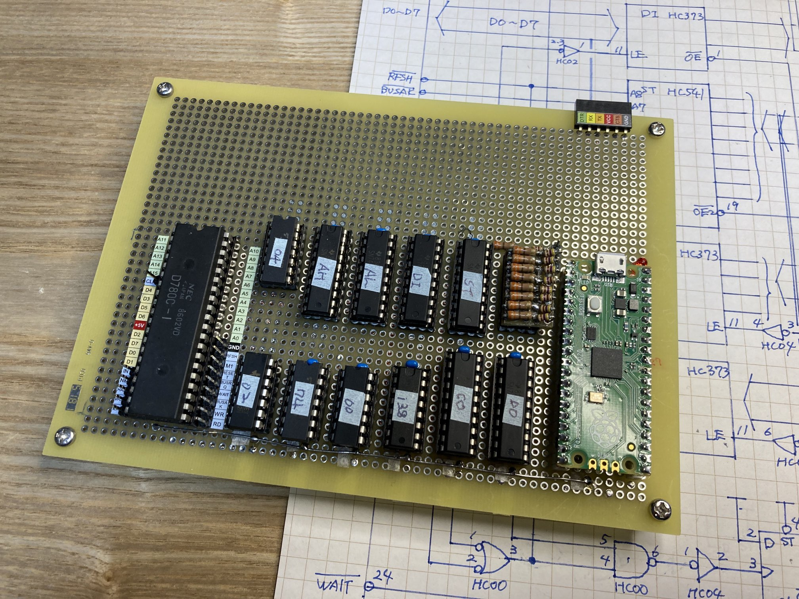
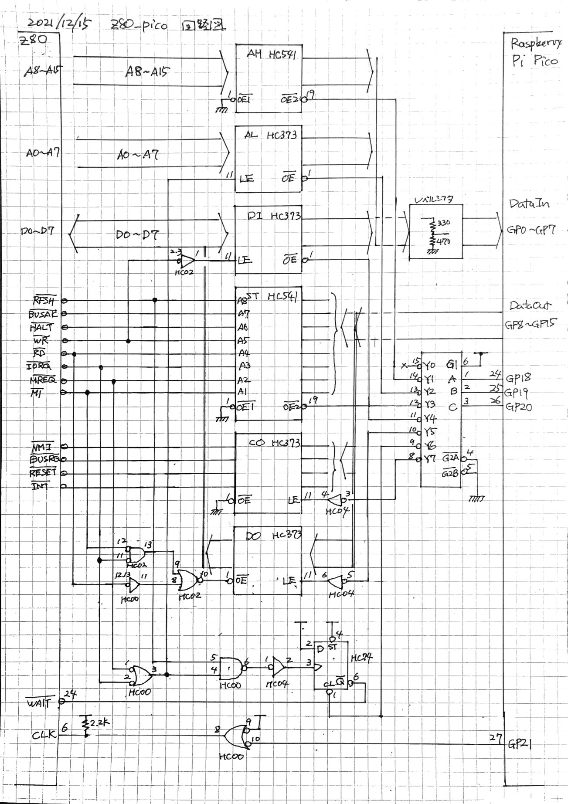
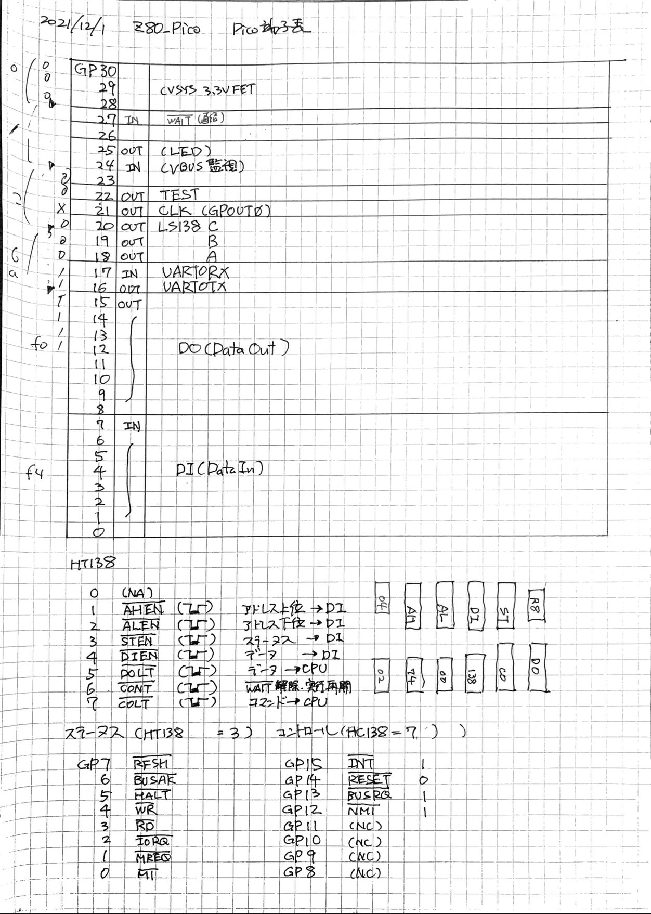
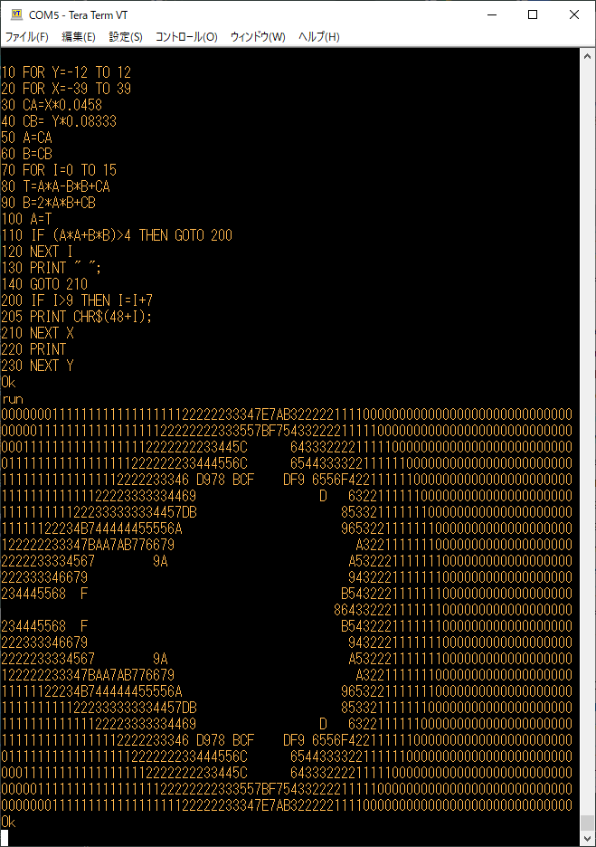

# z80_pico -- A Raspberry Pi Pico system to drive Z80 CPU

z80_pico is a Raspberry Pi Pico system to drive Z80 CPU and to execute 8080/Z80 systems, including Microsoft BASIC, CP/M Disk Operating System.

It provides clock, ROM/RAM(64kB full RAM), Serial Interface (i8251 emulator), and INTA vector support for Z80.  All of the functionalities are recides in Pico board.  ROM/RAM is an character array in RP2040 CPU, Serial Interface is a combination of hardware (RP2040 UART0) and software (i8251 status/data register emulation).

The board has a huge number of 74HC logic devices, for /WAIT generator, address/data bus buffers for multiplexing (it uses 8bit input and 8bit output GPIO on Pico).  I recognize that it is far from elegant design, but I dare to do it for my personal intention (for future possibility where VRAM/Display emulation on the other core of RP2040).

## Schematics

There are six buffers/latch for address/data bus, AH(Address High), AL(Address Low), DI(Data In), ST(Status signals), CO(Controls), and DO(Data Out).  The four of the buffers, AH, AL, ST, and DI are input (from the view of Pico) and the rest of the two, DO and CO  are output.  So the number of strobe/OE signals are large and direct connecting all of them to Pico GPIO.  A 3-to-8 decoder can decrease the necessary number of GPIOs.

||C|B|A|Signal Name|Description|
|--|--|--|--|:-----|:--|
|0|L|L|L|(none)|none of buffers are activated
|1|L|L|H|/AHEN|Address High -> DI (GPIO0-7)
|2|L|H|L|/ALEN|Address Low -> DI (GPIO0-7)
|3|L|H|H|/STEN|Status -> DI (GPIO0-7)
|4|H|L|L|/DIEN|Data -> DI (GPIO0-7)
|5|H|L|H|/DOLT|DO(GPIO8-15) -> Data
|6|H|H|L|/CONT|Continue, /WAIT deactivated
|7|H|H|H|/COLT|Control -> Data

There are eight Level shifters (5V -> 3.3V) between DO buffers and RP2040 DI (GPIO0-7).  I do not put level shifters between DI buffers and GPIO8-15.  Without level shifters, 3.3V output can drive 5V CMOS gate inputs, and we do not have any critial issues, so it is okay.

## /WAIT control

Pico handles all of memory access of Z80 CPU.  It gets address, puts the data from RAM, or gets data from Z80 CPU to be stored in RAM.

It is essential to find when Z80 starts a memory cycle. In this system, every memory cycle are stretched by means of /WAIT signal of Z80 CPU.  In appropliate period /WAIT signal is activated, Z80 CPU 'waits' its completion of the cycle, with providing address and /RD, /WR signals so that environmental curcuit can prepare data in READ cycle, or fetch data from Z80 data bus to store the memory. Environmental curcuit can have enough time because Z80 'waits' for its rising edge without proceeding its cycle.

Even if RP2040 CPU is fast, it is still hard to issue /WAIT in time to make Z80 surely to start wait state.  A half of 74HC74, D-FF takes falling edge of /MREQ to flip its output /Q, directly connecting to /WAIT input of Z80 CPU.

In order to avoid mistaking RFSH cycle as usual memory cycle, /RFSH signal should refer to omit /MREQ falling edge from D-FF clock input.

## Z80 interrupt hardware emulation

This system emulates "SBC8080" where receiving data in i8251 happens an interrupt on i8080, in INTA cycle an 0xff (or RST7)
instruction is put on data bus.  These features are implemented on Pico software.

On hardware side, INTA cycle should catch and start /WAIT state.  M1 && IREQ cause it.

## 'unwait' CPU and proper bus control

In any Z80 and Pico (or any other modern microcontroller) system, /WAIT release and release data bus (or make Pico data bus as input mode) is critial (or essential).  I am glad to adopt a hardware logic (DO buffer and its /OE signal connected to /RD) to handle this issue.  No software provision is needed.  If we implement it as software, this issue will become much more confusing. 

## Pin Assign

|GPIO number|In/Out|Name, description|
|--:|--|:--|
|GP29|IN|(IP used in ADC mode (ADC3) to measure VSYS/3)|
|28||unused|
|27|IN|/WAIT|
|26||unused|
|25|OUT|(OP connected to user LED)|
|24|IN|(IP VBUS sense)|
|23|OUT|(OP Controls the on-board SMPS Power Save pin)|
|22|OUT|TEST ... software controlled TEST pin, used for debug|
|21|OUT|CLK (GPOUT0)|
|20|OUT|HC138 C|
|19|OUT|HC138 B|
|18|OUT|HC138 A|
|17|IN|UART0 RX|
|16|OUT|UART0 TX|
|15-8|OUT|DO (Data Out)|
|7-0|IN|DI (Data In)|

## Z80 software

The current Z80 software is MSBASIC for [SBC8080](https://vintagechips.wordpress.com/2018/06/24/sbc8080-cpu%E3%83%AB%E3%83%BC%E3%82%BA%E3%82%AD%E3%83%83%E3%83%88/).  [Its datapack](http://www.amy.hi-ho.ne.jp/officetetsu/storage/sbc8080_datapack.zip) includes a file, `MSBAS80.HEX` as its binary HEX file.  Clock for Z80 CPU is 3.8MHz, effectively about 2MHz, with 3 WAIT cycles.  I use it to run 'ASCIIART.BAS', as a kind of benchmark.  It took 8min 23secs.

